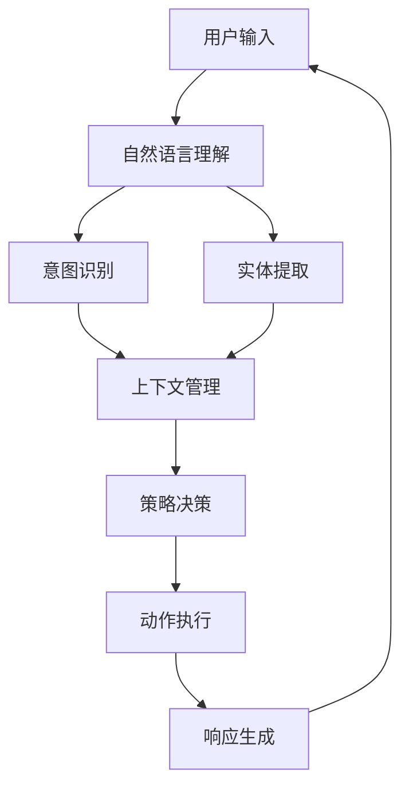
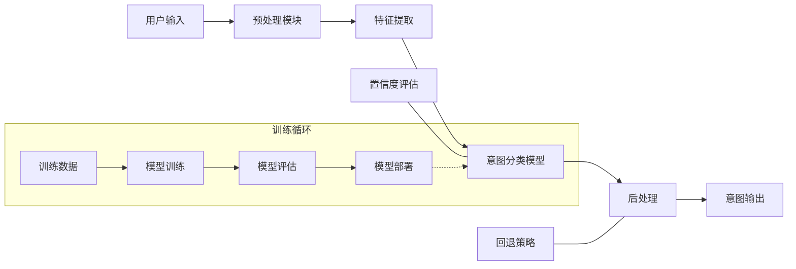
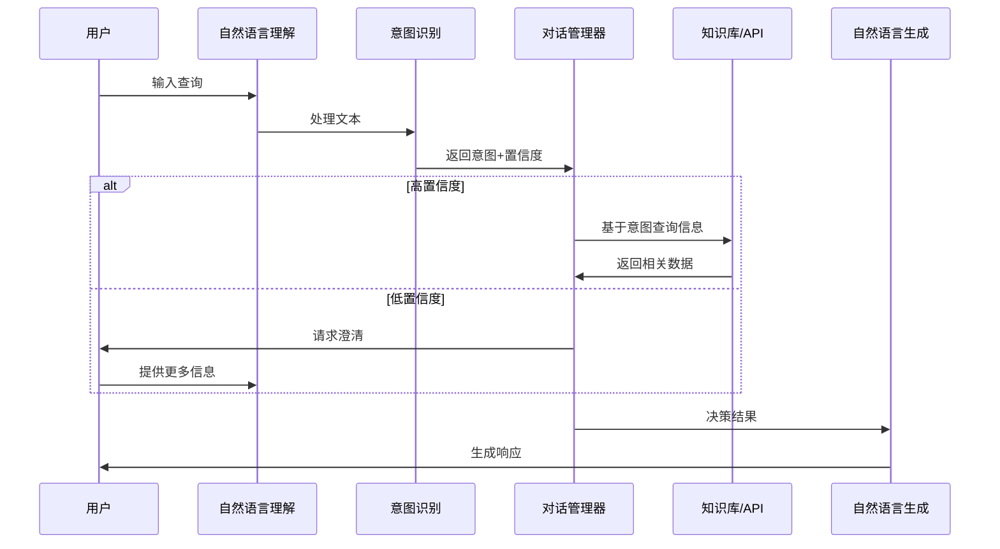
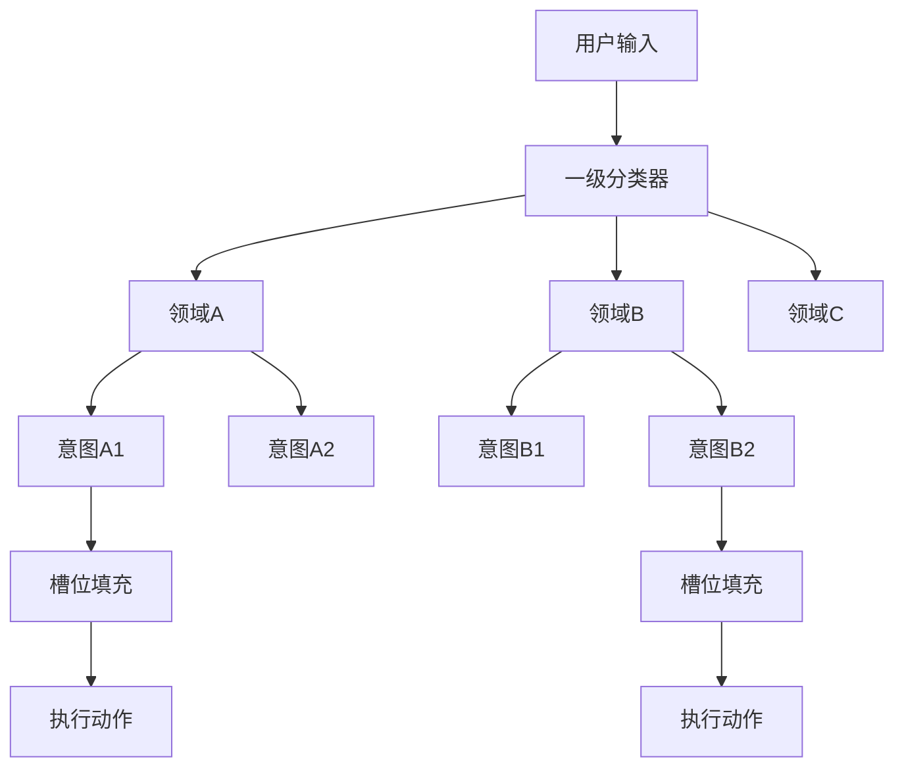
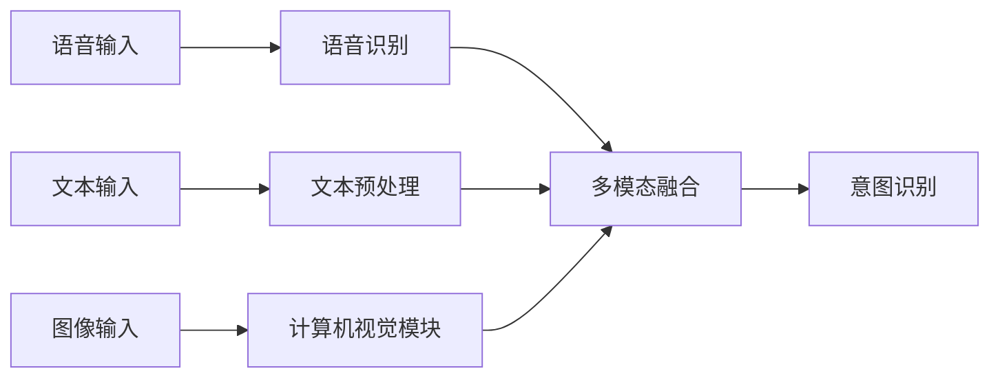
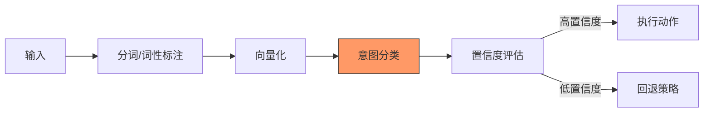
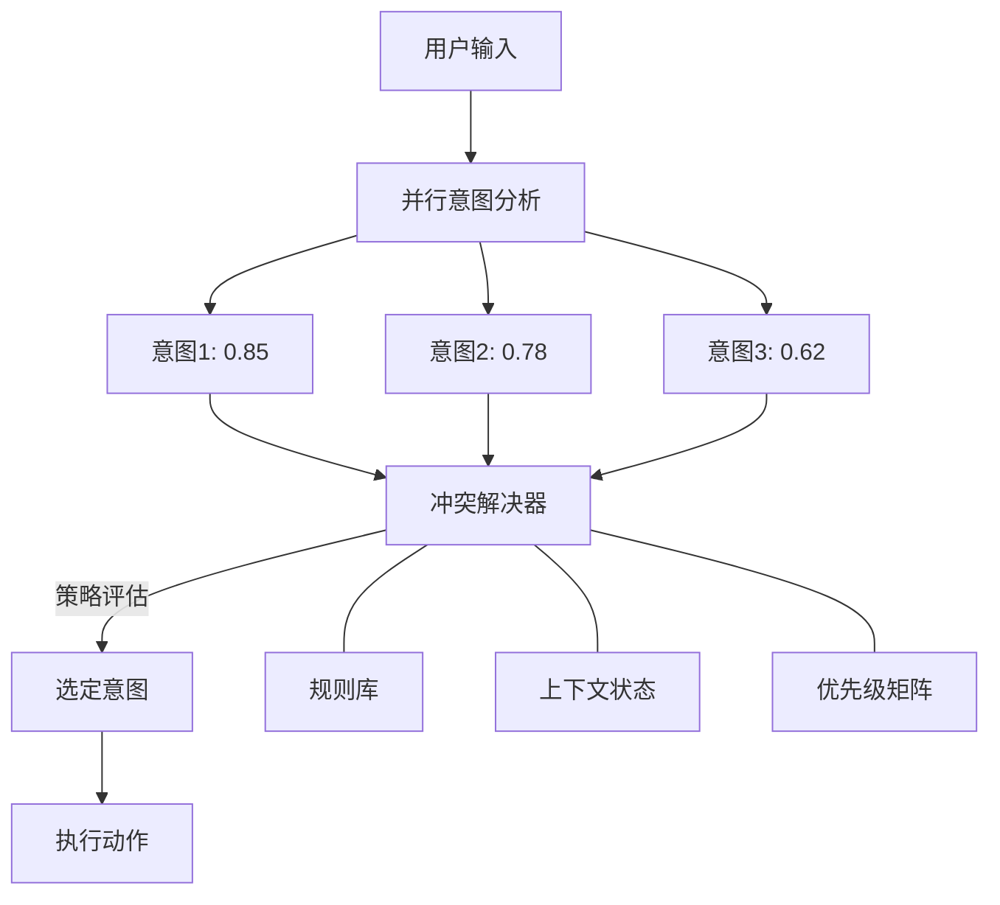
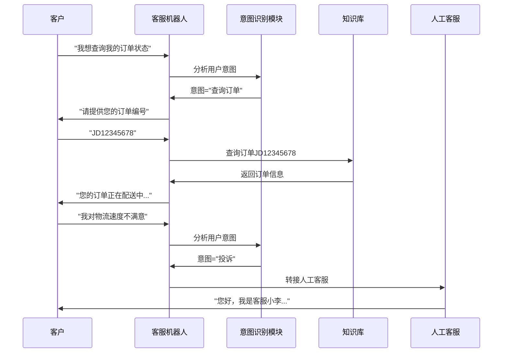
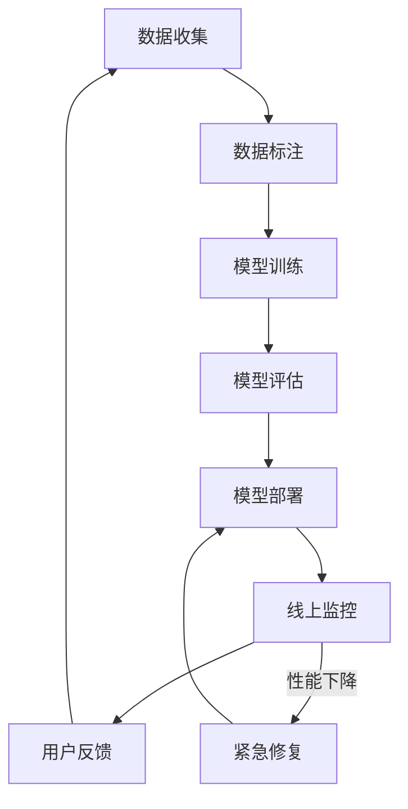

# 意图识别的工程应用

意图识别是智能代理（Agent）系统中的核心组件，它决定了代理如何理解用户请求并采取相应行动。本文将从工程角度详细介绍意图识别的应用及其在代理生命周期中的关键作用。

## 在Agent生命周期中的作用 {id="agent_1"}

意图识别在Agent的生命周期中扮演着"理解用户需求的桥梁"角色，是将用户自然语言输入转化为系统可执行操作的关键环节。

在这个循环中，意图识别是整个交互流程的起点和核心决策依据，直接影响后续的处理路径和响应质量。

## 意图识别的工程架构

从工程实现角度，一个完整的意图识别系统通常包含以下组件：

## 意图识别在Agent决策流程中的位置 {id="agent_2"}

## 意图识别的多级架构

在复杂系统中，意图识别常采用多级架构，提高准确性和健壮性：

## 工程实现的关键考量

### 1. 前端接入

### 2. 实时处理流水线

### 3. 意图冲突解决策略

在并行的多意图识别系统中，可能出现意图冲突，需要优先级判断：

## 案例：客服机器人中的意图识别流程

## 意图识别的DevOps流程

在工程实践中，意图识别系统需要持续优化和迭代：

## 技术选型考量

实际工程中，意图识别的技术选型需要平衡多种因素：

|技术方案|优势|劣势|适用场景|
|-------|---|---|------|
|基于规则|实现简单，可解释性强|覆盖有限，维护成本高|领域特定，表达方式固定|
|传统ML|资源消耗低，部署简单|特征工程复杂|资源受限环境|
|深度学习|准确率高，自动特征学习|资源消耗大，需大量数据|复杂多样的表述场景|
|LLM微调|泛化能力强，少样本学习|计算成本高|开放域对话|
|混合方案|兼顾规则确定性和模型灵活性|系统复杂度高|企业级应用|

## 在Agent系统中的集成最佳实践

1. **模块化设计**：意图识别作为独立微服务，提供标准API
2. **分级处理**：从粗粒度到细粒度的意图层级结构
3. **多模型集成**：集成多种技术的意图识别器，投票决策
4. **在线学习**：根据用户反馈持续优化意图识别模型
5. **透明解释**：提供意图识别的依据和置信度

## 结论

意图识别是智能代理系统的"大脑"，决定了代理如何理解用户需求并触发后续处理流程。优秀的意图识别系统不仅需要准确的算法模型，还需要考虑工程实现的健壮性、可扩展性和可维护性。随着技术的发展，意图识别正朝着多模态、上下文感知和持续学习的方向演进，为构建更智能、更自然的人机交互体验奠定基础。 