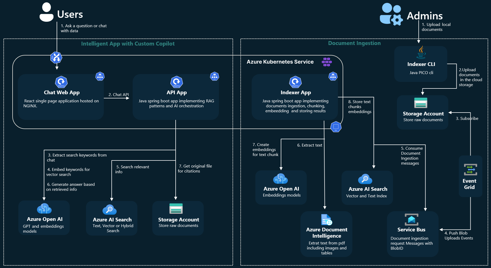

# RAG 工程实践 - Java实现

## 技术栈选择 {id="tech_stack"}

### 核心组件

**向量数据库**:
- Milvus - 高性能分布式向量数据库
- Elasticsearch + 向量搜索插件 - 成熟稳定的搜索引擎
- PGVector - PostgreSQL的向量扩展
- Weaviate - 支持多模态的向量数据库

**嵌入模型**:
- Sentence Transformers - 开源文本嵌入模型
- OpenAI Embeddings API - 高质量商用嵌入
- Hugging Face模型 - 丰富的预训练模型

**语言模型**:
- OpenAI GPT API - 性能最佳的商用选择
- LangChain4j - Java语言的LangChain实现
- LocalAI - 本地部署开源模型

### Java技术栈

**Web框架**:
- Spring Boot - 主流微服务框架
- Quarkus - 云原生Java框架
- Micronaut - 轻量级微服务框架

**数据处理**:
- Apache Tika - 文档解析
- Apache POI - Office文档处理
- PDFBox - PDF处理
- JSoup - HTML解析

**缓存**:
- Redis - 分布式缓存
- Caffeine - 本地缓存
- Hazelcast - 分布式缓存和计算

**消息队列**:
- RabbitMQ - AMQP消息队列
- Kafka - 分布式流处理平台
- ActiveMQ - JMS实现

**监控与指标**:
- Micrometer - 应用指标收集
- Prometheus - 监控系统
- ELK Stack - 日志分析平台

## 系统架构 {id="system_architecture_continued"}

### 微服务架构示例 {id="microservice_architecture"}

RAG系统在Java中通常采用微服务架构，将各个功能模块解耦，以便于扩展和维护：

文档处理服务 → 嵌入生成服务 → 向量存储服务 → 查询处理服务 → 响应生成服务

**RAG微服务架构组件**:
- **用户**: 系统终端用户
- **API网关**: 统一入口，路由请求
- **文档处理服务**: 解析和预处理文档
- **嵌入生成服务**: 将文本转换为向量嵌入
- **向量存储服务**: 管理向量数据的存储和检索
- **查询处理服务**: 处理用户查询并协调检索
- **响应生成服务**: 利用检索内容生成回答
- **向量数据库**: 存储文档嵌入向量
- **大语言模型API**: 提供生成式AI能力

**数据流**:
1. 文档流: 用户 → API网关 → 文档处理 → 嵌入生成 → 向量存储 → 向量数据库
2. 查询流: 用户 → API网关 → 查询处理 → (嵌入生成+向量存储) → 响应生成 → API网关 → 用户

### 组件交互流程 {id="component_interaction"}

1. **文档摄入流程**：文档上传 → 文本提取 → 文本分块 → 嵌入生成 → 向量存储
2. **查询处理流程**：用户查询 → 查询嵌入 → 相似度搜索 → 上下文组装 → LLM响应生成

## 代码实现 {id="code_implementation"}

### 文档处理模块 {id="document_processing"}

使用Apache Tika实现多格式文档的文本提取：

<code-block collapsible="true" lang="java">
import org.apache.tika.Tika;
import org.apache.tika.exception.TikaException;
import org.springframework.stereotype.Service;

import java.io.IOException;
import java.io.InputStream;

@Service
public class DocumentProcessor {
    private final Tika tika = new Tika();
    
    public String extractText(InputStream inputStream, String mimeType) throws IOException, TikaException {
        return tika.parseToString(inputStream);
    }
    
    public List<String> splitIntoChunks(String text, int chunkSize, int overlap) {
        List<String> chunks = new ArrayList<>();
        // 实现文本分块逻辑，考虑句子和段落边界
        // ...
        return chunks;
    }
}
</code-block>

### 文本分块策略 {id="text_chunking"}

实现智能分块，保持语义完整性：

<code-block collapsible="true" lang="java">
public List&lt;String&gt; splitTextIntoChunks(String text, int targetChunkSize, int overlap) {
    List&lt;String&gt; sentences = splitIntoSentences(text);
    List&lt;String&gt; chunks = new ArrayList&lt;&gt;();
    StringBuilder currentChunk = new StringBuilder();

    for (int i = 0; i &lt; sentences.size(); i++) {
        String sentence = sentences.get(i);
        
        // 如果当前块加上新句子不超过目标大小，则添加
        if (currentChunk.length() + sentence.length() &lt;= targetChunkSize) {
            currentChunk.append(sentence).append(" ");
        } else {
            // 保存当前块并创建新块
            chunks.add(currentChunk.toString().trim());
            
            // 新块从上一块的末尾开始，实现重叠
            int overlapStart = Math.max(0, i - calculateSentencesForOverlap(sentences, i, overlap));
            currentChunk = new StringBuilder();
            for (int j = overlapStart; j &lt;= i; j++) {
                currentChunk.append(sentences.get(j)).append(" ");
            }
        }
    }
    
    // 添加最后一个块
    if (currentChunk.length() &gt; 0) {
        chunks.add(currentChunk.toString().trim());
    }
    
    return chunks;

}

private List&lt;String&gt; splitIntoSentences(String text) {
// 使用NLP库如OpenNLP或Stanford NLP进行句子分割
// 这里简化为基本实现
return Arrays.asList(text.split("(?&lt;=[.!?])\\s+"));
}

private int calculateSentencesForOverlap(List&lt;String&gt; sentences, int currentIndex, int targetOverlap) {
int charCount = 0;
int sentenceCount = 0;

    for (int i = currentIndex - 1; i &gt;= 0; i--) {
        charCount += sentences.get(i).length();
        sentenceCount++;
        if (charCount &gt;= targetOverlap) {
            break;
        }
    }
    
    return sentenceCount;

}
</code-block>

### 嵌入生成模块 {id="embedding_generation"}

使用LangChain4j与OpenAI API集成：

<code-block collapsible="true" lang="java">
import dev.langchain4j.data.embedding.Embedding;
import dev.langchain4j.model.embedding.EmbeddingModel;
import dev.langchain4j.model.openai.OpenAiEmbeddingModel;
import org.springframework.beans.factory.annotation.Value;
import org.springframework.stereotype.Service;

@Service
public class EmbeddingService {
    private final EmbeddingModel embeddingModel;
    
    public EmbeddingService(@Value("${openai.api.key}") String apiKey) {
        this.embeddingModel = OpenAiEmbeddingModel.builder()
                .apiKey(apiKey)
                .modelName("text-embedding-ada-002")
                .build();
    }
    
    public Embedding generateEmbedding(String text) {
        return embeddingModel.embed(text).content();
    }
    
    public List<Embedding> batchGenerateEmbeddings(List<String> texts) {
        return texts.stream()
                .map(this::generateEmbedding)
                .collect(Collectors.toList());
    }
}
</code-block>

### 向量存储模块 {id="vector_storage"}

使用PGVector实现向量存储：

<code-block collapsible="true" lang="java">
import org.springframework.jdbc.core.JdbcTemplate;
import org.springframework.stereotype.Repository;

import java.sql.Array;
import java.sql.Connection;
import java.sql.PreparedStatement;
import java.util.List;
import java.util.UUID;

@Repository
public class PgVectorRepository {
    private final JdbcTemplate jdbcTemplate;
    
    public PgVectorRepository(JdbcTemplate jdbcTemplate) {
        this.jdbcTemplate = jdbcTemplate;
        initializeDatabase();
    }
    
    private void initializeDatabase() {
        // 创建向量扩展和表
        jdbcTemplate.execute("CREATE EXTENSION IF NOT EXISTS vector");
        jdbcTemplate.execute(
                "CREATE TABLE IF NOT EXISTS document_chunks (" +
                "id UUID PRIMARY KEY, " +
                "content TEXT NOT NULL, " +
                "metadata JSONB, " +
                "embedding vector(1536)" +
                ")"
        );
        jdbcTemplate.execute(
                "CREATE INDEX IF NOT EXISTS document_chunks_embedding_idx " +
                "ON document_chunks USING ivfflat (embedding vector_cosine_ops) WITH (lists = 100)"
        );
    }
    
    public void saveDocumentChunk(String content, float[] embedding, String metadata) {
        jdbcTemplate.execute(connection -> {
            PreparedStatement ps = connection.prepareStatement(
                    "INSERT INTO document_chunks (id, content, embedding, metadata) VALUES (?, ?, ?, ?::jsonb)"
            );
            ps.setObject(1, UUID.randomUUID());
            ps.setString(2, content);
            Array embeddingArray = connection.createArrayOf("real", toObjectArray(embedding));
            ps.setArray(3, embeddingArray);
            ps.setString(4, metadata);
            return ps;
        });
    }
    
    public List<DocumentChunk> findSimilarDocuments(float[] queryEmbedding, int limit) {
        return jdbcTemplate.query(
                "SELECT id, content, metadata, " +
                "1 - (embedding <=> ?) AS similarity " +
                "FROM document_chunks " +
                "ORDER BY similarity DESC " +
                "LIMIT ?",
                (rs, rowNum) -> new DocumentChunk(
                        rs.getObject("id", UUID.class),
                        rs.getString("content"),
                        rs.getString("metadata"),
                        rs.getDouble("similarity")
                ),
                queryEmbedding,
                limit
        );
    }
    
    private Object[] toObjectArray(float[] array) {
        Float[] result = new Float[array.length];
        for (int i = 0; i < array.length; i++) {
            result[i] = array[i];
        }
        return result;
    }
}
</code-block>

### 查询处理模块 {id="query_processing"}

<code-block collapsible="true" lang="java">
import dev.langchain4j.data.embedding.Embedding;
import org.springframework.stereotype.Service;

@Service
public class QueryService {
    private final EmbeddingService embeddingService;
    private final PgVectorRepository vectorRepository;
    
    public QueryService(EmbeddingService embeddingService, PgVectorRepository vectorRepository) {
        this.embeddingService = embeddingService;
        this.vectorRepository = vectorRepository;
    }
    
    public List<DocumentChunk> retrieveRelevantDocuments(String query, int limit) {
        // 生成查询嵌入
        Embedding queryEmbedding = embeddingService.generateEmbedding(query);
        
        // 查找相似文档
        return vectorRepository.findSimilarDocuments(queryEmbedding.vectorAsList().stream()
                .mapToFloat(Float::floatValue)
                .toArray(), limit);
    }
    
    public String buildContext(List<DocumentChunk> relevantChunks) {
        // 根据相关性和多样性构建上下文
        return relevantChunks.stream()
                .sorted(Comparator.comparingDouble(DocumentChunk::getSimilarity).reversed())
                .map(DocumentChunk::getContent)
                .collect(Collectors.joining("\n\n"));
    }
}
</code-block>

### 响应生成模块 {id="response_generation"}

使用LangChain4j与OpenAI API集成：

<code-block collapsible="true" lang="java">
import dev.langchain4j.model.chat.ChatLanguageModel;
import dev.langchain4j.model.openai.OpenAiChatModel;
import dev.langchain4j.service.AiServices;
import org.springframework.beans.factory.annotation.Value;
import org.springframework.stereotype.Service;

@Service
public class ResponseGenerationService {
    private final ChatLanguageModel chatModel;
    private final QueryService queryService;
    private final RagChatService ragChatService;
    
    public ResponseGenerationService(
            @Value("${openai.api.key}") String apiKey,
            QueryService queryService) {
        this.chatModel = OpenAiChatModel.builder()
                .apiKey(apiKey)
                .modelName("gpt-4")
                .temperature(0.7f)
                .build();
        this.queryService = queryService;
        this.ragChatService = AiServices.create(RagChatService.class, chatModel);
    }
    
    public String generateResponse(String query) {
        // 检索相关文档
        List<DocumentChunk> relevantDocs = queryService.retrieveRelevantDocuments(query, 5);
        
        // 构建上下文
        String context = queryService.buildContext(relevantDocs);
        
        // 生成回答
        return ragChatService.chat(context, query);
    }
    
    interface RagChatService {
        @SystemMessage("""
                你是一个知识丰富的助手。请使用以下上下文信息回答用户的问题。
                如果你不知道答案，请说你不知道，不要编造信息。
                
                上下文信息:
                {{context}}
                """)
        String chat(@ContextVariable("context") String context, @UserMessage String userMessage);
    }
}
</code-block>

## 高级功能实现 {id="advanced_features"}

### 元数据过滤 {id="metadata_filtering"}

<code-block collapsible="true" lang="java">
public List&lt;DocumentChunk&gt; retrieveWithMetadataFilter(String query, String metadataFilter, int limit) {
    Embedding queryEmbedding = embeddingService.generateEmbedding(query);

    return jdbcTemplate.query(
            "SELECT id, content, metadata, " +
            "1 - (embedding &lt;=&gt; ?) AS similarity " +
            "FROM document_chunks " +
            "WHERE metadata @&gt; ?::jsonb " +
            "ORDER BY similarity DESC " +
            "LIMIT ?",
            (rs, rowNum) -&gt; new DocumentChunk(
                    rs.getObject("id", UUID.class),
                    rs.getString("content"),
                    rs.getString("metadata"),
                    rs.getDouble("similarity")
            ),
            queryEmbedding.vectorAsList().stream().mapToFloat(Float::floatValue).toArray(),
            metadataFilter,
            limit
    );

}
</code-block>

### 混合搜索 {id="hybrid_search"}

结合向量搜索和关键词搜索：

<code-block collapsible="true" lang="java">
public List&lt;DocumentChunk&gt; hybridSearch(String query, int limit) {
    Embedding queryEmbedding = embeddingService.generateEmbedding(query);

    return jdbcTemplate.query(
            "SELECT id, content, metadata, " +
            "0.7 * (1 - (embedding &lt;=&gt; ?)) + " +
            "0.3 * ts_rank_cd(to_tsvector('english', content), plainto_tsquery('english', ?)) " +
            "AS hybrid_score " +
            "FROM document_chunks " +
            "WHERE to_tsvector('english', content) @@ plainto_tsquery('english', ?) " +
            "ORDER BY hybrid_score DESC " +
            "LIMIT ?",
            (rs, rowNum) -&gt; new DocumentChunk(
                    rs.getObject("id", UUID.class),
                    rs.getString("content"),
                    rs.getString("metadata"),
                    rs.getDouble("hybrid_score")
            ),
            queryEmbedding.vectorAsList().stream().mapToFloat(Float::floatValue).toArray(),
            query,
            query,
            limit
    );

}
</code-block>

### 缓存实现 {id="caching_implementation"}

使用Spring Cache和Redis实现缓存：

<code-block collapsible="true" lang="java">
import org.springframework.cache.annotation.Cacheable;
import org.springframework.stereotype.Service;

@Service
public class CachedResponseService {
    private final ResponseGenerationService responseService;
    
    public CachedResponseService(ResponseGenerationService responseService) {
        this.responseService = responseService;
    }
    
    @Cacheable(value = "responses", key = "#query", unless = "#result == null")
    public String getResponse(String query) {
        return responseService.generateResponse(query);
    }
}
</code-block>

Redis配置：

<code-block collapsible="true" lang="java">
import org.springframework.cache.CacheManager;
import org.springframework.cache.annotation.EnableCaching;
import org.springframework.context.annotation.Bean;
import org.springframework.context.annotation.Configuration;
import org.springframework.data.redis.cache.RedisCacheConfiguration;
import org.springframework.data.redis.cache.RedisCacheManager;
import org.springframework.data.redis.connection.RedisConnectionFactory;

import java.time.Duration;

@Configuration
@EnableCaching
public class CacheConfig {
    @Bean
    public CacheManager cacheManager(RedisConnectionFactory connectionFactory) {
        RedisCacheConfiguration config = RedisCacheConfiguration.defaultCacheConfig()
                .entryTtl(Duration.ofHours(24))
                .disableCachingNullValues();
                
        return RedisCacheManager.builder(connectionFactory)
                .cacheDefaults(config)
                .build();
    }
}
</code-block>

## 性能优化 {id="performance_optimization"}

### 批处理与异步处理 {id="batch_processing"}

使用Spring的异步功能处理大量文档：

<code-block collapsible="true" lang="java">
import org.springframework.scheduling.annotation.Async;
import org.springframework.stereotype.Service;

import java.util.List;
import java.util.concurrent.CompletableFuture;

@Service
public class AsyncDocumentProcessor {
    private final DocumentProcessor documentProcessor;
    private final EmbeddingService embeddingService;
    private final PgVectorRepository vectorRepository;
    
    @Async
    public CompletableFuture<Void> processDocumentBatch(List<String> documents, String metadata) {
        List<String> chunks = documents.stream()
                .flatMap(doc -> documentProcessor.splitIntoChunks(doc, 1000, 200).stream())
                .collect(Collectors.toList());
                
        // 批量生成嵌入
        List<Embedding> embeddings = embeddingService.batchGenerateEmbeddings(chunks);
        
        // 批量保存
        for (int i = 0; i < chunks.size(); i++) {
            vectorRepository.saveDocumentChunk(
                chunks.get(i),
                embeddings.get(i).vectorAsList().stream().mapToFloat(Float::floatValue).toArray(),
                metadata
            );
        }
        
        return CompletableFuture.completedFuture(null);
    }
}
</code-block>

### 连接池优化 {id="connection_pool_optimization"}

<code-block collapsible="true" lang="java">
import com.zaxxer.hikari.HikariConfig;
import com.zaxxer.hikari.HikariDataSource;
import org.springframework.context.annotation.Bean;
import org.springframework.context.annotation.Configuration;

import javax.sql.DataSource;

@Configuration
public class DatabaseConfig {
    @Bean
    public DataSource dataSource() {
        HikariConfig config = new HikariConfig();
        config.setJdbcUrl("jdbc:postgresql://localhost:5432/ragdb");
        config.setUsername("postgres");
        config.setPassword("password");
        config.setMaximumPoolSize(20);
        config.setMinimumIdle(5);
        config.setConnectionTimeout(30000);
        config.setIdleTimeout(600000);
        config.setMaxLifetime(1800000);
        
        return new HikariDataSource(config);
    }
}
</code-block>

### Micrometer指标收集 {id="micrometer_metrics"}

<code-block collapsible="true" lang="java">
import io.micrometer.core.instrument.MeterRegistry;
import io.micrometer.core.instrument.Timer;
import org.springframework.stereotype.Component;

@Component
public class RagMetrics {
    private final Timer embeddingGenerationTimer;
    private final Timer vectorSearchTimer;
    private final Timer responseGenerationTimer;
    
    public RagMetrics(MeterRegistry registry) {
        this.embeddingGenerationTimer = registry.timer("rag.embedding.generation");
        this.vectorSearchTimer = registry.timer("rag.vector.search");
        this.responseGenerationTimer = registry.timer("rag.response.generation");
    }
    
    public Timer getEmbeddingGenerationTimer() {
        return embeddingGenerationTimer;
    }
    
    public Timer getVectorSearchTimer() {
        return vectorSearchTimer;
    }
    
    public Timer getResponseGenerationTimer() {
        return responseGenerationTimer;
    }
}
</code-block>

### 日志与追踪 {id="logging_tracing"}

<code-block collapsible="true" lang="java">
import org.slf4j.Logger;
import org.slf4j.LoggerFactory;
import org.springframework.stereotype.Service;

@Service
public class TracedQueryService {
    private static final Logger logger = LoggerFactory.getLogger(TracedQueryService.class);
    private final QueryService queryService;
    private final RagMetrics metrics;
    
    public TracedQueryService(QueryService queryService, RagMetrics metrics) {
        this.queryService = queryService;
        this.metrics = metrics;
    }
    
    public String processQuery(String query) {
        String requestId = UUID.randomUUID().toString();
        logger.info("Processing query [{}]: {}", requestId, query);
        
        long startTime = System.currentTimeMillis();
        
        try {
            // 记录向量搜索时间
            List<DocumentChunk> relevantDocs = metrics.getVectorSearchTimer()
                    .record(() -> queryService.retrieveRelevantDocuments(query, 5));
            
            logger.info("Query [{}]: Retrieved {} relevant documents in {}ms", 
                    requestId, relevantDocs.size(), System.currentTimeMillis() - startTime);
            
            // 构建上下文
            String context = queryService.buildContext(relevantDocs);
            
            // 记录响应生成时间
            String response = metrics.getResponseGenerationTimer()
                    .record(() -> ragChatService.chat(context, query));
            
            logger.info("Query [{}]: Generated response in {}ms", 
                    requestId, System.currentTimeMillis() - startTime);
            
            return response;
        } catch (Exception e) {
            logger.error("Error processing query [{}]: {}", requestId, e.getMessage(), e);
            throw e;
        }
    }
}
</code-block>

## 部署与扩展 {id="deployment_scaling"}

### Docker配置 {id="docker_configuration"}

<code-block collapsible="true" lang="Docker">
FROM eclipse-temurin:17-jdk-alpine
WORKDIR /app
COPY target/rag-application.jar app.jar
EXPOSE 8080
ENTRYPOINT ["java", "-jar", "app.jar"]
</code-block>

### Kubernetes配置 {id="kubernetes_configuration"}

<code-block collapsible="true" lang="yaml">
apiVersion: apps/v1
kind: Deployment
metadata:
  name: rag-service
spec:
  replicas: 3
  selector:
    matchLabels:
      app: rag-service
  template:
    metadata:
      labels:
        app: rag-service
    spec:
      containers:
      - name: rag-service
        image: rag-service:latest
        ports:
        - containerPort: 8080
        resources:
          requests:
            memory: "1Gi"
            cpu: "500m"
          limits:
            memory: "2Gi"
            cpu: "1000m"
        env:
        - name: SPRING_PROFILES_ACTIVE
          value: "prod"
        - name: OPENAI_API_KEY
          valueFrom:
            secretKeyRef:
              name: openai-credentials
              key: api-key
        - name: SPRING_DATASOURCE_URL
          value: "jdbc:postgresql://postgres:5432/ragdb"
        - name: SPRING_REDIS_HOST
          value: "redis"
</code-block>

## 总结 {id="conclusion"}

本文详细介绍了使用Java实现RAG系统的各个关键组件和技术点，包括：

1. **文档处理**：使用Apache Tika提取文本，实现智能分块策略
2. **嵌入生成**：通过LangChain4j与OpenAI API集成
3. **向量存储**：使用PGVector实现高效向量检索
4. **查询处理**：结合向量相似度搜索和元数据过滤
5. **响应生成**：使用LLM生成高质量回答
6. **高级功能**：混合搜索、缓存、批处理和异步处理
7. **监控与可观测性**：使用Micrometer收集指标，实现日志和追踪
8. **部署与扩展**：Docker和Kubernetes配置

通过这些实现，可以构建一个高性能、可扩展的RAG系统，为各种应用场景提供智能问答能力。

