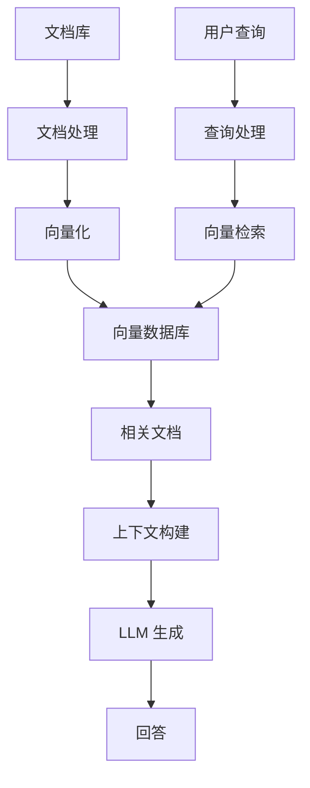
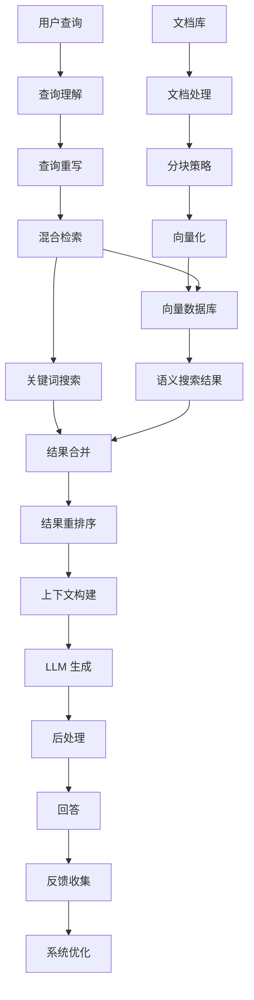
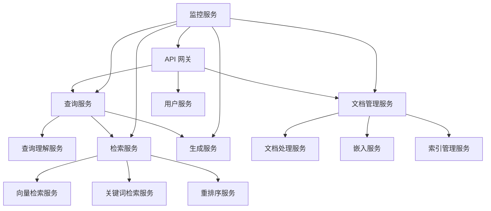

# RAG 工程实践：系统设计与实现

检索增强生成 (RAG) 系统的工程实现涉及多个关键环节，从技术选型到部署维护。本文将从工程师视角，详细介绍如何构建高效、可靠的 RAG 系统。

## 技术栈选择 {id="tech_stack"}

构建 RAG 系统的第一步是选择合适的技术组件，包括嵌入模型、向量数据库和语言模型。

### 嵌入模型选择 {id="embedding_models"}

嵌入模型负责将文本转换为向量表示，是 RAG 系统的基础组件。

| 模型 | 优势 | 适用场景 | 资源需求 |
|-----|------|---------|---------|
| OpenAI Embeddings | 高质量、易用、多语言支持 | 通用领域、快速开发 | API 调用费用 |
| Sentence Transformers | 开源、可本地部署、多种预训练模型 | 成本敏感场景、私有部署 | GPU 内存 4-8GB |
| E5/BGE 系列 | 多语言支持、开源、检索性能优秀 | 多语言应用、特定领域 | GPU 内存 8-16GB |
| Cohere Embeddings | 多语言优化、长文本支持 | 国际化应用、长文档 | API 调用费用 |
| Jina Embeddings | 高维度、开源、支持多模态 | 复杂语义场景、研究 | GPU 内存 8-16GB |

**选择考量因素**：
- 语言支持：是否需要多语言或特定语言优化
- 部署方式：云服务 API 还是本地部署
- 成本预算：API 调用费用或硬件投入
- 向量维度：高维度通常提供更好的语义表示能力
- 领域适应性：通用模型还是特定领域优化模型

### 向量数据库选择 {id="vector_databases"}

向量数据库用于存储和检索文档嵌入，是 RAG 系统的核心存储组件。

| 数据库 | 优势 | 适用场景 | 部署复杂度 |
|-------|------|---------|-----------|
| Pinecone | 托管服务、易扩展、高可用性 | 生产环境、需要高可用性 | 低（云服务） |
| Weaviate | 多模态支持、图谱能力、混合搜索 | 复杂数据关系、多模态 | 中等 |
| Milvus | 高性能、开源、分布式架构 | 大规模部署、自定义需求 | 高 |
| Chroma | 轻量级、易集成、开发友好 | 原型开发、小型应用 | 低 |
| FAISS (Meta) | 高效索引、内存优化、学术支持 | 资源受限环境、研究 | 中等 |
| Qdrant | 过滤查询强大、开源、易用性好 | 需要复杂过滤条件的应用 | 中等 |
| Vespa | 全功能搜索、排序、实时更新 | 大规模生产系统、复杂查询 | 高 |

**选择考量因素**：
- 规模需求：预期的文档数量和查询负载
- 部署环境：云服务、本地部署或混合架构
- 查询功能：是否需要复杂的过滤和排序
- 元数据支持：是否需要基于元数据的过滤
- 更新频率：知识库更新的频率和方式
- 运维复杂度：团队的运维能力和资源

### LLM 选择 {id="llm_selection"}

语言模型负责基于检索结果生成最终回答，直接影响系统输出质量。

| 模型 | 优势 | 适用场景 | 资源需求 |
|-----|------|---------|---------|
| GPT-4/GPT-3.5 | 强大理解力、易用、多语言支持 | 企业应用、复杂任务 | API 调用费用 |
| Claude 系列 | 长上下文、遵循指令、安全性高 | 文档分析、合规场景 | API 调用费用 |
| Llama 2/3 | 开源、可本地部署、多种规模 | 成本敏感、私有部署 | GPU 16-32GB |
| Mistral 系列 | 轻量高效、开源、性能优异 | 资源受限、边缘部署 | GPU 8-16GB |
| Gemma | 轻量级、开源、优化良好 | 资源受限场景、移动设备 | GPU 8-16GB |
| Qwen | 中文优化、开源、多种规模 | 中文应用场景 | GPU 16-32GB |

**选择考量因素**：
- 性能需求：回答质量和推理能力要求
- 部署方式：API 调用还是本地部署
- 上下文长度：需要处理的检索结果数量
- 语言支持：目标语言的支持程度
- 成本预算：API 费用或硬件投入
- 安全合规：数据隐私和合规要求

## 系统架构设计 {id="system_architecture"}

RAG 系统架构需要考虑数据流、组件交互和扩展性，以满足不同规模和复杂度的应用需求。

### 基础 RAG 架构 {id="basic_architecture"}

适用于原型开发和小型应用的简单架构：



**核心组件**：
- **文档处理管道**：加载、清洗、分块文档
- **嵌入管道**：生成并存储文档向量
- **检索模块**：执行向量相似度搜索
- **生成模块**：构建提示并调用 LLM

### 生产级 RAG 架构 {id="production_architecture"}

适用于企业级应用的高可用、可扩展架构：



**增强组件**：
- **查询理解与重写**：优化用户查询以提高检索效果
- **混合检索策略**：结合语义搜索和关键词搜索
- **结果重排序**：使用更精确的模型对初步结果排序
- **后处理模块**：格式化、引用验证、内容过滤
- **反馈循环**：收集用户反馈并持续优化系统

### 微服务架构 {id="microservices_architecture"}

适用于大规模、高负载应用的分布式架构：



**架构优势**：
- **独立扩展**：根据负载单独扩展各个服务
- **技术异构**：不同服务可使用最适合的技术栈
- **故障隔离**：单个服务故障不影响整个系统
- **开发效率**：团队可以并行开发不同服务
- **灵活部署**：支持混合云或多区域部署

## 工程实现步骤 {id="implementation_steps"}

### 1. 数据准备与索引构建 {id="data_preparation"}

#### 文档加载与处理 {id="document_loading"}

<code-block lang="python" collapsible="true">
from langchain_community.document_loaders import DirectoryLoader, PyPDFLoader, CSVLoader
from langchain.text_splitter import RecursiveCharacterTextSplitter

# 加载不同类型的文档
loaders = {
    "pdf": DirectoryLoader('./documents/pdf/', glob="**/*.pdf", loader_cls=PyPDFLoader),
    "csv": DirectoryLoader('./documents/csv/', glob="**/*.csv", loader_cls=CSVLoader),
    "txt": DirectoryLoader('./documents/text/', glob="**/*.txt")
}

documents = []
for doc_type, loader in loaders.items():
    docs = loader.load()
    # 添加文档类型元数据
    for doc in docs:
        doc.metadata["doc_type"] = doc_type
    documents.extend(docs)

# 文档分块策略
text_splitter = RecursiveCharacterTextSplitter(
    chunk_size=1000,
    chunk_overlap=200,
    length_function=len,
    add_start_index=True,
)
chunks = text_splitter.split_documents(documents)

# 增强元数据
for i, chunk in enumerate(chunks):
    chunk.metadata["chunk_id"] = i
    # 保留原始文档信息
    if "source" in chunk.metadata:
        chunk.metadata["document_name"] = chunk.metadata["source"].split("/")[-1]
    # 添加时间戳
    chunk.metadata["indexed_at"] = datetime.now().isoformat()
</code-block>

#### 向量化与索引 {id="vectorization_indexing"}

<code-block lang="python" collapsible="true">
from langchain_openai import OpenAIEmbeddings
from langchain_community.vectorstores import Chroma
import os

# 初始化嵌入模型
embeddings = OpenAIEmbeddings(
    model="text-embedding-3-large",  # 选择模型
    dimensions=1536,  # 指定维度
)

# 创建向量数据库
persist_directory = "./chroma_db"
vectorstore = Chroma.from_documents(
    documents=chunks,
    embedding=embeddings,
    persist_directory=persist_directory,
    collection_name="company_knowledge_base",
    collection_metadata={"description": "公司内部知识库", "version": "1.0"}
)

# 持久化存储
vectorstore.persist()

# 创建备份
import shutil
from datetime import datetime
backup_dir = f"./backups/chroma_{datetime.now().strftime('%Y%m%d_%H%M%S')}"
os.makedirs(backup_dir, exist_ok=True)
shutil.copytree(persist_directory, backup_dir)
</code-block>

#### 增量更新策略 {id="incremental_updates"}

<code-block lang="python" collapsible="true">
def update_knowledge_base(new_documents, vectorstore):
    """增量更新知识库"""
    # 处理新文档
    text_splitter = RecursiveCharacterTextSplitter(
        chunk_size=1000,
        chunk_overlap=200,
    )
    new_chunks = text_splitter.split_documents(new_documents)
    
    # 添加元数据
    for i, chunk in enumerate(new_chunks):
        chunk.metadata["chunk_id"] = f"new_{i}"
        chunk.metadata["indexed_at"] = datetime.now().isoformat()
        chunk.metadata["update_type"] = "incremental"
    
    # 添加到向量数据库
    vectorstore.add_documents(new_chunks)
    vectorstore.persist()
    
    print(f"已添加 {len(new_chunks)} 个新文档块到知识库")
    return len(new_chunks)
</code-block>

### 2. 检索与生成实现 {id="retrieval_generation"}

#### 基础 RAG 实现 {id="basic_rag"}

<code-block lang="python" collapsible="true">
from langchain_openai import ChatOpenAI
from langchain.chains import RetrievalQA
from langchain.prompts import PromptTemplate

# 自定义提示模板
template = """你是一个知识助手，使用以下检索到的信息回答用户问题。
如果无法从提供的信息中找到答案，请说明无法回答，不要编造信息。

检索到的信息:
{context}

用户问题: {question}

回答:"""

CUSTOM_PROMPT_TEMPLATE = PromptTemplate(
    input_variables=["context", "question"],
    template=template
)

# 初始化检索器
retriever = vectorstore.as_retriever(
    search_type="similarity",  # 相似度搜索
    search_kwargs={"k": 5}     # 返回前5个结果
)

# 初始化语言模型
llm = ChatOpenAI(
    model_name="gpt-4",  # 选择模型
    temperature=0,       # 降低随机性
    max_tokens=1024      # 限制回答长度
)

# 创建 RAG 链
qa_chain = RetrievalQA.from_chain_type(
    llm=llm,
    chain_type="stuff",  # 简单合并所有检索结果
    retriever=retriever,
    return_source_documents=True,  # 返回源文档
    chain_type_kwargs={
        "prompt": CUSTOM_PROMPT_TEMPLATE
    }
)

# 查询示例
def query_knowledge_base(question):
    """查询知识库"""
    try:
        response = qa_chain({"query": question})
        
        # 提取源文档信息
        sources = []
        for doc in response["source_documents"]:
            sources.append({
                "content": doc.page_content[:100] + "...",  # 截取前100个字符
                "source": doc.metadata.get("document_name", "未知"),
                "doc_type": doc.metadata.get("doc_type", "未知"),
                "indexed_at": doc.metadata.get("indexed_at", "未知")
            })
        
        return {
            "answer": response["result"],
            "sources": sources
        }
    except Exception as e:
        return {"error": str(e)}
</code-block>

#### 高级 RAG 实现 {id="advanced_rag"}

<code-block lang="python" collapsible="true">
from langchain.chains import LLMChain
from langchain.retrievers import ContextualCompressionRetriever
from langchain.retrievers.document_compressors import LLMChainExtractor
from langchain_community.retrievers import BM25Retriever

# 查询转换
def transform_query(query, llm):
    """使用 LLM 重写查询以提高检索效果"""
    prompt = PromptTemplate(
        input_variables=["query"],
        template="""请将以下用户查询重写为更适合文档检索的形式，添加相关关键词，但保持原始语义。
        
        用户查询: {query}
        检索查询:"""
    )
    chain = LLMChain(llm=llm, prompt=prompt)
    transformed_query = chain.run(query)
    return transformed_query

# 上下文压缩
def create_compression_retriever(base_retriever, llm):
    """创建上下文压缩检索器"""
    compressor = LLMChainExtractor.from_llm(llm)
    compression_retriever = ContextualCompressionRetriever(
        base_retriever=base_retriever,
        base_compressor=compressor
    )
    return compression_retriever

# 混合检索
def create_hybrid_retriever(documents, vector_retriever, llm, top_k=5):
    """创建混合检索器"""
    # 创建 BM25 检索器
    bm25_retriever = BM25Retriever.from_documents(documents)
    bm25_retriever.k = top_k
    
    class HybridRetriever:
        def __init__(self, vector_retriever, keyword_retriever, llm, top_k=5):
            self.vector_retriever = vector_retriever
            self.keyword_retriever = keyword_retriever
            self.llm = llm
            self.top_k = top_k
        
        def get_relevant_documents(self, query):
            # 查询重写
            enhanced_query = transform_query(query, self.llm)
            
            # 向量检索
            vector_docs = self.vector_retriever.get_relevant_documents(enhanced_query)
            
            # 关键词检索
            keyword_docs = self.keyword_retriever.get_relevant_documents(query)
            
            # 结果合并与去重
            seen_content = set()
            unique_docs = []
            
            # 先添加向量检索结果
            for doc in vector_docs:
                content_hash = hash(doc.page_content)
                if content_hash not in seen_content:
                    seen_content.add(content_hash)
                    doc.metadata["retrieval_method"] = "vector"
                    unique_docs.append(doc)
            
            # 再添加关键词检索结果
            for doc in keyword_docs:
                content_hash = hash(doc.page_content)
                if content_hash not in seen_content:
                    seen_content.add(content_hash)
                    doc.metadata["retrieval_method"] = "keyword"
                    unique_docs.append(doc)
            
            # 结果重排序
            reranker = RerankerModel()
            reranked_docs = reranker.rerank(query, unique_docs, self.top_k)
            
            return reranked_docs[:self.top_k]
    
    return HybridRetriever(vector_retriever, bm25_retriever, llm, top_k)

# 重排序模型
class RerankerModel:
    def __init__(self, model_name='cross-encoder/ms-marco-MiniLM-L-6-v2'):
        from sentence_transformers import CrossEncoder
        self.model = CrossEncoder(model_name)
        
    def rerank(self, query, documents, top_k=None):
        """重排序检索结果"""
        if not documents:
            return []
            
        # 准备模型输入
        pairs = [(query, doc.page_content) for doc in documents]
        
        # 计算相关性分数
        scores = self.model.predict(pairs)
        
        # 排序
        scored_documents = list(zip(documents, scores))
        scored_documents.sort(key=lambda x: x[1], reverse=True)
        
        # 返回排序后的文档
        if top_k:
            return [doc for doc, _ in scored_documents[:top_k]]
        return [doc for doc, _ in scored_documents]
</code-block>

### 3. Web 服务与 API 实现 {id="web_service_api"}

#### FastAPI 服务 {id="fastapi_service"}

<code-block lang="python" collapsible="true">
from fastapi import FastAPI, HTTPException, Depends, BackgroundTasks
from pydantic import BaseModel
from typing import List, Optional, Dict, Any
import uvicorn
import time
import logging

# 配置日志
logging.basicConfig(
    level=logging.INFO,
    format='%(asctime)s - %(name)s - %(levelname)s - %(message)s',
    handlers=[
        logging.FileHandler("rag_api.log"),
        logging.StreamHandler()
    ]
)
logger = logging.getLogger("rag_api")

app = FastAPI(title="RAG API", version="1.0.0")

# 数据模型
class Query(BaseModel):
    text: str
    top_k: Optional[int] = 5
    use_hybrid: Optional[bool] = True
    filters: Optional[Dict[str, Any]] = None

class Source(BaseModel):
    content: str
    source: str
    doc_type: str
    retrieval_method: Optional[str] = None

class Response(BaseModel):
    answer: str
    sources: List[Source]
    processing_time: float

# 依赖项
def get_retriever(use_hybrid: bool = True, filters: Optional[Dict[str, Any]] = None):
    """获取检索器"""
    if use_hybrid:
        retriever = hybrid_retriever
    else:
        # 基础向量检索器
        search_kwargs = {"k": 10}  # 检索更多结果，后续会重排序
        if filters:
            search_kwargs["filter"] = filters
        retriever = vectorstore.as_retriever(
            search_type="similarity",
            search_kwargs=search_kwargs
        )
    return retriever

# API 端点
@app.post("/rag/query", response_model=Response)
async def query_rag(
    query: Query,
    background_tasks: BackgroundTasks,
    retriever = Depends(get_retriever)
):
    start_time = time.time()
    logger.info(f"收到查询: {query.text}")
    
    try:
        # 执行检索
        if query.filters:
            retriever_with_filters = get_retriever(query.use_hybrid, query.filters)
            docs = retriever_with_filters.get_relevant_documents(query.text)
        else:
            docs = retriever.get_relevant_documents(query.text)
        
        # 限制返回数量
        docs = docs[:query.top_k]
        
        # 构建上下文
        context = "\n\n".join([doc.page_content for doc in docs])
        
        # 生成回答
        response = llm.predict(
            text=f"""请基于以下信息回答问题。如果无法从提供的信息中找到答案，请说明无法回答，不要编造信息。
            
            信息:
            {context}
            
            问题: {query.text}
            
            回答:"""
        )
        
        # 格式化源文档
        sources = []
        for doc in docs:
            sources.append(Source(
                content=doc.page_content[:150] + "..." if len(doc.page_content) > 150 else doc.page_content,
                source=doc.metadata.get("document_name", "未知"),
                doc_type=doc.metadata.get("doc_type", "未知"),
                retrieval_method=doc.metadata.get("retrieval_method", "未知")
            ))
        
        # 记录查询日志（异步）
        background_tasks.add_task(
            log_query,
            query=query.text,
            answer=response,
            sources=[s.source for s in sources],
            processing_time=time.time() - start_time
        )
        
        return Response(
            answer=response,
            sources=sources,
            processing_time=time.time() - start_time
        )
    except Exception as e:
        logger.error(f"处理查询时出错: {str(e)}", exc_info=True)
        raise HTTPException(status_code=500, detail=str(e))

# 日志记录
def log_query(query: str, answer: str, sources: List[str], processing_time: float):
    """记录查询日志"""
    logger.info(f"查询: {query}")
    logger.info(f"回答: {answer[:100]}...")
    logger.info(f"来源: {sources}")
    logger.info(f"处理时间: {processing_time:.2f}秒")

# 健康检查
@app.get("/health")
async def health_check():
    return {"status": "healthy", "version": "1.0.0"}

# 启动服务
if __name__ == "__main__":
    uvicorn.run("app:app", host="0.0.0.0", port=8000, reload=True)
</code-block>

#### 缓存实现 {id="caching_implementation"}

<code-block lang="python" collapsible="true">
import redis
import json
import hashlib
from functools import wraps

# 初始化 Redis 客户端
redis_client = redis.Redis(host='localhost', port=6379, db=0)

def get_cache_key(query, top_k, filters):
    """生成缓存键"""
    cache_str = f"{query}_{top_k}_{json.dumps(filters or {}, sort_keys=True)}"
    return hashlib.md5(cache_str.encode()).hexdigest()

def cache_result(expire=3600):
    """缓存装饰器"""
    def decorator(func):
        @wraps(func)
        async def wrapper(query: Query, background_tasks: BackgroundTasks, retriever):
            # 检查是否禁用缓存
            if query.text.startswith("nocache:"):
                query.text = query.text[8:].strip()
                return await func(query, background_tasks, retriever)
            
            # 生成缓存键
            cache_key = get_cache_key(query.text, query.top_k, query.filters)
            
            # 检查缓存
            cached = redis_client.get(cache_key)
            if cached:
                logger.info(f"缓存命中: {query.text}")
                cached_data = json.loads(cached)
                return Response(**cached_data)
            
            # 执行原始函数
            result = await func(query, background_tasks, retriever)
            
            # 设置缓存
            redis_client.setex(
                cache_key,
                expire,
                json.dumps(result.dict())
            )
            
            return result
        return wrapper
    return decorator

# 应用缓存装饰器
@app.post("/rag/query", response_model=Response)
@cache_result(expire=1800)  # 30分钟缓存
async def query_rag(
    query: Query,
    background_tasks: BackgroundTasks,
    retriever = Depends(get_retriever)
):
    # 原始实现...
</code-block>

### 4. 部署与扩展 {id="deployment_scaling"}

#### Docker 容器化 {id="docker_containerization"}

<code-block lang="DOCKER">
# Dockerfile
FROM python:3.10-slim

WORKDIR /app

# 安装系统依赖
RUN apt-get update && apt-get install -y \
    build-essential \
    && rm -rf /var/lib/apt/lists/*

# 复制依赖文件
COPY requirements.txt .

# 安装依赖
RUN pip install --no-cache-dir -r requirements.txt

# 复制应用代码
COPY . .

# 暴露端口
EXPOSE 8000

# 启动命令
CMD ["uvicorn", "app:app", "--host", "0.0.0.0", "--port", "8000"]
</code-block>

<code-block>
# requirements.txt
fastapi==0.103.1
uvicorn==0.23.2
langchain==0.0.267
langchain_openai==0.0.2
langchain_community==0.0.9
openai==1.3.0
chromadb==0.4.13
redis==4.6.0
sentence-transformers==2.2.2
pydantic==2.4.2
python-dotenv==1.0.0 
</code-block>

#### Docker Compose 配置 {id="docker_compose"}

<code-block lang="yaml" collapsible="true">
# docker-compose.yml
version: '3'

services:
  rag-api:
    build: .
    ports:
      - "8000:8000"
    volumes:
      - ./data:/app/data
      - ./config:/app/config
    environment:
      - OPENAI_API_KEY=${OPENAI_API_KEY}
      - REDIS_HOST=redis
      - REDIS_PORT=6379
    depends_on:
      - redis
    restart: unless-stopped
    deploy:
      resources:
        limits:
          cpus: '2'
          memory: 4G
  
  redis:
    image: redis:alpine
    ports:
      - "6379:6379"
    volumes:
      - redis_data:/data
    command: redis-server --appendonly yes
    restart: unless-stopped
  
  nginx:
    image: nginx:latest
    ports:
      - "80:80"
      - "443:443"
    volumes:
      - ./nginx/nginx.conf:/etc/nginx/nginx.conf
      - ./nginx/ssl:/etc/nginx/ssl
      - ./static:/usr/share/nginx/html
    depends_on:
      - rag-api
    restart: unless-stopped

volumes:
  redis_data:
</code-block>

#### Kubernetes 部署 {id="kubernetes_deployment"}

<code-block lang="yaml" collapsible="true">
# rag-deployment.yaml
apiVersion: apps/v1
kind: Deployment
metadata:
  name: rag-api
  namespace: rag-system
spec:
  replicas: 3
  selector:
    matchLabels:
      app: rag-api
  template:
    metadata:
      labels:
        app: rag-api
    spec:
      containers:
      - name: rag-api
        image: your-registry/rag-api:latest
        ports:
        - containerPort: 8000
        resources:
          requests:
            memory: "2Gi"
            cpu: "500m"
          limits:
            memory: "4Gi"
            cpu: "2"
        env:
        - name: OPENAI_API_KEY
          valueFrom:
            secretKeyRef:
              name: rag-secrets
              key: openai-api-key
        - name: REDIS_HOST
          value: redis-service
        - name: REDIS_PORT
          value: "6379"
        volumeMounts:
        - name: config-volume
          mountPath: /app/config
        - name: data-volume
          mountPath: /app/data
        readinessProbe:
          httpGet:
            path: /health
            port: 8000
          initialDelaySeconds: 10
          periodSeconds: 30
      volumes:
      - name: config-volume
        configMap:
          name: rag-config
      - name: data-volume
        persistentVolumeClaim:
          claimName: rag-data-pvc
---
apiVersion: v1
kind: Service
metadata:
  name: rag-api-service
  namespace: rag-system
spec:
  selector:
    app: rag-api
  ports:
  - port: 80
    targetPort: 8000
  type: ClusterIP
---
apiVersion: networking.k8s.io/v1
kind: Ingress
metadata:
  name: rag-api-ingress
  namespace: rag-system
  annotations:
    kubernetes.io/ingress.class: nginx
    cert-manager.io/cluster-issuer: letsencrypt-prod
spec:
  tls:
  - hosts:
    - rag-api.example.com
    secretName: rag-tls-secret
  rules:
  - host: rag-api.example.com
    http:
      paths:
      - path: /
        pathType: Prefix
        backend:
          service:
            name: rag-api-service
            port:
              number: 80
</code-block>

### 5. 性能优化与监控 {id="performance_monitoring"}

#### 性能优化策略 {id="performance_optimization"}

**批量处理**：

<code-block lang="python" collapsible="true">
from concurrent.futures import ThreadPoolExecutor
import asyncio

async def batch_process_documents(documents, batch_size=100):
    """批量处理文档"""
    total_docs = len(documents)
    batches = [documents[i:i+batch_size] for i in range(0, total_docs, batch_size)]
    
    processed_docs = []
    
    async def process_batch(batch):
        # 处理单个批次
        result = []
        with ThreadPoolExecutor() as executor:
            futures = [
                executor.submit(process_document, doc)
                for doc in batch
            ]
            for future in futures:
                result.append(future.result())
        return result
    
    # 并行处理所有批次
    tasks = [process_batch(batch) for batch in batches]
    results = await asyncio.gather(*tasks)
    
    # 合并结果
    for batch_result in results:
        processed_docs.extend(batch_result)
    
    return processed_docs

def process_document(doc):
    """处理单个文档"""
    # 文档处理逻辑
    # ...
    return processed_doc
</code-block>

**检索优化**：

<code-block lang="python" collapsible="true">
def optimize_retrieval_parameters():
    """优化检索参数"""
    # 测试不同的 k 值
    k_values = [3, 5, 7, 10]
    # 测试不同的相似度算法
    similarity_types = ["cosine", "euclidean", "dot_product"]
    # 测试不同的检索策略
    retrieval_types = ["similarity", "mmr"]
    
    results = {}
    
    # 准备评估数据集
    eval_queries = load_evaluation_queries()
    
    for k in k_values:
        for sim_type in similarity_types:
            for ret_type in retrieval_types:
                # 配置检索器
                search_kwargs = {"k": k, "score_threshold": 0.5}
                if ret_type == "mmr":
                    search_kwargs["fetch_k"] = k * 2
                    search_kwargs["lambda_mult"] = 0.5
                
                retriever = vectorstore.as_retriever(
                    search_type=ret_type,
                    search_kwargs=search_kwargs,
                    similarity_fn=sim_type
                )
                
                # 评估性能
                score = evaluate_retriever(retriever, eval_queries)
                
                # 记录结果
                config = f"k={k},sim={sim_type},ret={ret_type}"
                results[config] = score
    
    # 找出最佳配置
    best_config = max(results.items(), key=lambda x: x[1])
    logger.info(f"最佳检索配置: {best_config[0]} (分数: {best_config[1]})")
    
    return best_config
</code-block>

**模型量化**：

<code-block lang="python" collapsible="true">
from transformers import AutoModelForCausalLM, AutoTokenizer
import torch

def load_quantized_model(model_name, quantization="4bit"):
    """加载量化后的模型"""
    if quantization == "4bit":
        # 使用 bitsandbytes 进行 4 位量化
        model = AutoModelForCausalLM.from_pretrained(
            model_name,
            device_map="auto",
            load_in_4bit=True,
            quantization_config={
                "bnb_4bit_compute_dtype": torch.float16,
                "bnb_4bit_quant_type": "nf4",
                "bnb_4bit_use_double_quant": True
            }
        )
    elif quantization == "8bit":
        # 使用 bitsandbytes 进行 8 位量化
        model = AutoModelForCausalLM.from_pretrained(
            model_name,
            device_map="auto",
            load_in_8bit=True
        )
    else:
        # 使用 FP16 精度
        model = AutoModelForCausalLM.from_pretrained(
            model_name,
            device_map="auto",
            torch_dtype=torch.float16
        )
    
    tokenizer = AutoTokenizer.from_pretrained(model_name)
    return model, tokenizer
</code-block>

#### 监控系统 {id="monitoring_system"}

**Prometheus 指标**：

<code-block lang="python" collapsible="true">
from prometheus_client import Counter, Histogram, Gauge, Summary
import prometheus_client

# 定义指标
REQUESTS = Counter('rag_requests_total', 'Total RAG requests', ['endpoint', 'status'])
LATENCY = Histogram('rag_request_latency_seconds', 'RAG request latency', ['endpoint'])
TOKENS = Counter('rag_tokens_total', 'Total tokens used', ['model', 'type'])
CACHE_STATS = Counter('rag_cache_stats', 'Cache statistics', ['result'])
RETRIEVAL_COUNT = Histogram('rag_retrieval_document_count', 'Number of documents retrieved')
EMBEDDING_LATENCY = Histogram('rag_embedding_latency_seconds', 'Embedding generation latency')
LLM_LATENCY = Histogram('rag_llm_latency_seconds', 'LLM generation latency')
ACTIVE_REQUESTS = Gauge('rag_active_requests', 'Number of active requests')
DOCUMENT_COUNT = Gauge('rag_document_count', 'Number of documents in the knowledge base')
ERROR_COUNT = Counter('rag_errors_total', 'Total errors', ['type'])

# 更新文档计数
def update_document_count():
    """更新知识库文档数量指标"""
    try:
        count = vectorstore.get_collection_stats()["count"]
        DOCUMENT_COUNT.set(count)
    except Exception as e:
        logger.error(f"更新文档计数失败: {str(e)}")

# 暴露指标端点
@app.get("/metrics")
async def metrics():
    return prometheus_client.generate_latest()
</code-block>

**Grafana 仪表板**：

创建 `grafana-dashboard.json` 文件，包含以下面板：

1. 请求量和延迟
2. 缓存命中率
3. 检索文档数量分布
4. 令牌使用量
5. 错误率
6. 系统资源使用情况

**日志聚合**：

```python
import logging
from pythonjsonlogger import jsonlogger

# 配置 JSON 格式日志
class CustomJsonFormatter(jsonlogger.JsonFormatter):
    def add_fields(self, log_record, record, message_dict):
        super(CustomJsonFormatter, self).add_fields(log_record, record, message_dict)
        log_record['service'] = 'rag-api'
        log_record['hostname'] = socket.gethostname()
        log_record['timestamp'] = datetime.utcnow().isoformat()
        log_record['level'] = record.levelname
        if hasattr(record, 'request_id'):
            log_record['request_id'] = record.request_id

# 创建 JSON 格式处理器
logHandler = logging.StreamHandler()
formatter = CustomJsonFormatter('%(timestamp)s %(level)s %(name)s %(message)s')
logHandler.setFormatter(formatter)

# 配置根日志器
logger = logging.getLogger()
logger.setLevel(logging.INFO)
logger.addHandler(logHandler)

# 请求 ID 中间件
@app.middleware("http")
async def request_id_middleware(request, call_next):
    request_id = request.headers.get("X-Request-ID", str(uuid.uuid4()))
    
    # 将请求 ID 添加到日志上下文
    logger_adapter = logging.LoggerAdapter(
        logger, {"request_id": request_id}
    )
    
    # 将请求 ID 添加到响应头
    response = await call_next(request)
    response.headers["X-Request-ID"] = request_id
    
    return response
```

### 6. 安全与合规 {id="security_compliance"}

#### 数据安全 {id="data_security"}

**敏感信息处理**：

<code-block lang="python" collapsible="true">
import re
from typing import List, Pattern

class SensitiveDataFilter:
    """敏感数据过滤器"""
    
    def __init__(self):
        # 定义敏感信息模式
        self.patterns: List[Pattern] = [
            # 信用卡号
            re.compile(r'\b(?:\d{4}[-\s]?){3}\d{4}\b'),
            # 社会安全号
            re.compile(r'\b\d{3}[-\s]?\d{2}[-\s]?\d{4}\b'),
            # 电子邮件
            re.compile(r'\b[A-Za-z0-9._%+-]+@[A-Za-z0-9.-]+\.[A-Z|a-z]{2,}\b'),
            # 电话号码
            re.compile(r'\b(?:\+\d{1,3}[-\s]?)?\(?\d{3}\)?[-\s]?\d{3}[-\s]?\d{4}\b'),
            # IP 地址
            re.compile(r'\b\d{1,3}\.\d{1,3}\.\d{1,3}\.\d{1,3}\b')
        ]
        
        # 自定义敏感词列表
        self.sensitive_terms = [
            "密码", "password", "secret", "api_key", "apikey", "token",
            "access_key", "private_key", "credential"
        ]
    
    def filter_text(self, text: str) -> str:
        """过滤文本中的敏感信息"""
        # 替换正则匹配的敏感信息
        for pattern in self.patterns:
            text = pattern.sub("[REDACTED]", text)
        
        # 替换敏感词
        for term in self.sensitive_terms:
            # 使用单词边界确保只替换完整的词
            text = re.sub(r'\b' + re.escape(term) + r'\b', "[REDACTED]", text, flags=re.IGNORECASE)
        
        return text
    
    def filter_document(self, document) -> None:
        """过滤文档中的敏感信息"""
        if hasattr(document, 'page_content'):
            document.page_content = self.filter_text(document.page_content)
        
        # 过滤元数据中的敏感信息
        if hasattr(document, 'metadata') and isinstance(document.metadata, dict):
            for key, value in document.metadata.items():
                if isinstance(value, str):
                    document.metadata[key] = self.filter_text(value)

# 使用示例
sensitive_filter = SensitiveDataFilter()

# 在索引前过滤文档
def preprocess_documents(documents):
    """预处理文档，包括敏感信息过滤"""
    for doc in documents:
        sensitive_filter.filter_document(doc)
    return documents

# 在返回结果前过滤敏感信息
def filter_response(response):
    """过滤响应中的敏感信息"""
    if isinstance(response, dict):
        for key, value in response.items():
            if isinstance(value, str):
                response[key] = sensitive_filter.filter_text(value)
            elif isinstance(value, (dict, list)):
                filter_response(value)
    elif isinstance(response, list):
        for i, item in enumerate(response):
            if isinstance(item, str):
                response[i] = sensitive_filter.filter_text(item)
            elif isinstance(item, (dict, list)):
                filter_response(item)
    return response
</code-block>

**访问控制**：

<code-block lang="python" collapsible="true">
from fastapi import Depends, HTTPException, status
from fastapi.security import OAuth2PasswordBearer, OAuth2PasswordRequestForm
from jose import JWTError, jwt
from passlib.context import CryptContext
from datetime import datetime, timedelta
from pydantic import BaseModel

# 安全配置
SECRET_KEY = os.getenv("SECRET_KEY", "your-secret-key")
ALGORITHM = "HS256"
ACCESS_TOKEN_EXPIRE_MINUTES = 30

# 密码上下文
pwd_context = CryptContext(schemes=["bcrypt"], deprecated="auto")

# OAuth2 方案
oauth2_scheme = OAuth2PasswordBearer(tokenUrl="token")

# 用户模型
class User(BaseModel):
    username: str
    email: str
    full_name: Optional[str] = None
    disabled: Optional[bool] = None
    role: str = "user"

# 令牌模型
class Token(BaseModel):
    access_token: str
    token_type: str

# 验证用户
def authenticate_user(username: str, password: str):
    # 在实际应用中，从数据库获取用户
    user = get_user(username)
    if not user:
        return False
    if not pwd_context.verify(password, user.hashed_password):
        return False
    return user

# 创建访问令牌
def create_access_token(data: dict, expires_delta: Optional[timedelta] = None):
    to_encode = data.copy()
    if expires_delta:
        expire = datetime.utcnow() + expires_delta
    else:
        expire = datetime.utcnow() + timedelta(minutes=15)
    to_encode.update({"exp": expire})
    encoded_jwt = jwt.encode(to_encode, SECRET_KEY, algorithm=ALGORITHM)
    return encoded_jwt

# 获取当前用户
async def get_current_user(token: str = Depends(oauth2_scheme)):
    credentials_exception = HTTPException(
        status_code=status.HTTP_401_UNAUTHORIZED,
        detail="无效的身份验证凭据",
        headers={"WWW-Authenticate": "Bearer"},
    )
    try:
        payload = jwt.decode(token, SECRET_KEY, algorithms=[ALGORITHM])
        username: str = payload.get("sub")
        if username is None:
            raise credentials_exception
    except JWTError:
        raise credentials_exception
    user = get_user(username)
    if user is None:
        raise credentials_exception
    return user

# 获取活跃用户
async def get_current_active_user(current_user: User = Depends(get_current_user)):
    if current_user.disabled:
        raise HTTPException(status_code=400, detail="用户已禁用")
    return current_user

# 检查管理员权限
def check_admin_permission(current_user: User = Depends(get_current_active_user)):
    if current_user.role != "admin":
        raise HTTPException(
            status_code=status.HTTP_403_FORBIDDEN,
            detail="权限不足"
        )
    return current_user

# 登录端点
@app.post("/token", response_model=Token)
async def login_for_access_token(form_data: OAuth2PasswordRequestForm = Depends()):
    user = authenticate_user(form_data.username, form_data.password)
    if not user:
        raise HTTPException(
            status_code=status.HTTP_401_UNAUTHORIZED,
            detail="用户名或密码不正确",
            headers={"WWW-Authenticate": "Bearer"},
        )
    access_token_expires = timedelta(minutes=ACCESS_TOKEN_EXPIRE_MINUTES)
    access_token = create_access_token(
        data={"sub": user.username}, expires_delta=access_token_expires
    )
    return {"access_token": access_token, "token_type": "bearer"}

# 受保护的 API 端点
@app.post("/rag/query", response_model=Response)
async def query_rag(
    query: Query,
    current_user: User = Depends(get_current_active_user),
    retriever = Depends(get_retriever)
):
    # 记录用户信息
    logger.info(f"用户 {current_user.username} 执行查询: {query.text}")
    
    # 实现查询逻辑
    # ...
</code-block>

#### 合规与审计 {id="compliance_auditing"}

**审计日志**：

<code-block lang="python" collapsible="true">
import json
from datetime import datetime
import uuid

class AuditLogger:
    """审计日志记录器"""
    
    def __init__(self, log_file="audit.log"):
        self.log_file = log_file
    
    def log_event(self, event_type, user, action, details=None, status="success"):
        """记录审计事件"""
        event = {
            "timestamp": datetime.utcnow().isoformat(),
            "event_id": str(uuid.uuid4()),
            "event_type": event_type,
            "user": user,
            "action": action,
            "details": details or {},
            "status": status,
            "ip_address": get_client_ip(),
            "user_agent": get_user_agent()
        }
        
        with open(self.log_file, "a") as f:
            f.write(json.dumps(event) + "\n")
        
        return event

# 初始化审计日志记录器
audit_logger = AuditLogger()

# 中间件
@app.middleware("http")
async def audit_middleware(request, call_next):
    # 获取用户信息
    user = "anonymous"
    try:
        token = request.headers.get("Authorization", "").replace("Bearer ", "")
        if token:
            payload = jwt.decode(token, SECRET_KEY, algorithms=[ALGORITHM])
            user = payload.get("sub", "anonymous")
    except:
        pass
    
    # 记录请求
    event_details = {
        "path": request.url.path,
        "method": request.method,
        "query_params": str(request.query_params)
    }
    
    audit_logger.log_event(
        event_type="api_request",
        user=user,
        action=f"{request.method} {request.url.path}",
        details=event_details
    )
    
    # 处理请求
    response = await call_next(request)
    
    # 记录响应
    response_details = {
        "status_code": response.status_code
    }
    
    audit_logger.log_event(
        event_type="api_response",
        user=user,
        action=f"{request.method} {request.url.path}",
        details=response_details,
        status="success" if response.status_code < 400 else "failure"
    )
    
    return response

# 查询审计日志
def query_audit_logs(start_time=None, end_time=None, user=None, event_type=None, limit=100):
    """查询审计日志"""
    results = []
    
    with open(audit_logger.log_file, "r") as f:
        for line in f:
            try:
                event = json.loads(line)
                
                # 应用过滤条件
                if start_time and event["timestamp"] < start_time:
                    continue
                if end_time and event["timestamp"] > end_time:
                    continue
                if user and event["user"] != user:
                    continue
                if event_type and event["event_type"] != event_type:
                    continue
                
                results.append(event)
                
                if len(results) >= limit:
                    break
            except:
                continue
    
    return results
</code-block>

**内容过滤**：

<code-block lang="python" collapsible="true">
class ContentFilter:
    """内容过滤器"""
    
    def __init__(self):
        # 加载禁止词列表
        self.prohibited_terms = [
            "违法", "色情", "赌博", "毒品", "武器", "恐怖主义",
            "illegal", "pornography", "gambling", "drugs", "weapons", "terrorism"
        ]
        
        # 编译正则表达式
        self.prohibited_patterns = [
            re.compile(r'\b' + re.escape(term) + r'\b', re.IGNORECASE)
            for term in self.prohibited_terms
        ]
    
    def contains_prohibited_content(self, text):
        """检查文本是否包含禁止内容"""
        if not text:
            return False
            
        for pattern in self.prohibited_patterns:
            if pattern.search(text):
                return True
        
        return False
    
    def filter_query(self, query):
        """过滤查询"""
        if self.contains_prohibited_content(query):
            raise HTTPException(
                status_code=status.HTTP_400_BAD_REQUEST,
                detail="查询包含不适当内容"
            )
        return query
    
    def filter_response(self, response):
        """过滤响应"""
        if isinstance(response, str) and self.contains_prohibited_content(response):
            return "响应包含不适当内容，已被过滤。"
        return response

# 初始化内容过滤器
content_filter = ContentFilter()

# 在 API 中使用
@app.post("/rag/query", response_model=Response)
async def query_rag(
    query: Query,
    background_tasks: BackgroundTasks,
    retriever = Depends(get_retriever)
):
    # 过滤查询
    filtered_query_text = content_filter.filter_query(query.text)
    query.text = filtered_query_text
    
    # 执行查询逻辑
    # ...
    
    # 过滤响应
    response.answer = content_filter.filter_response(response.answer)
    
    return response
</code-block>

### 7. 测试与评估 {id="testing_evaluation"}

#### 单元测试 {id="unit_testing"}

<code-block lang="python" collapsible="true">
# test_retriever.py
import unittest
from unittest.mock import MagicMock, patch
import numpy as np

class TestRetriever(unittest.TestCase):
    
    def setUp(self):
        # 创建模拟的向量存储
        self.mock_vectorstore = MagicMock()
        self.mock_vectorstore.similarity_search.return_value = [
            MagicMock(page_content="测试文档1", metadata={"source": "test1.txt"}),
            MagicMock(page_content="测试文档2", metadata={"source": "test2.txt"})
        ]
        
        # 创建检索器
        self.retriever = self.mock_vectorstore.as_retriever(search_kwargs={"k": 2})
    
    def test_retrieval(self):
        # 测试检索功能
        docs = self.retriever.get_relevant_documents("测试查询")
        
        # 验证调用
        self.mock_vectorstore.similarity_search.assert_called_once_with("测试查询", k=2)
        
        # 验证结果
        self.assertEqual(len(docs), 2)
        self.assertEqual(docs[0].page_content, "测试文档1")
        self.assertEqual(docs[1].page_content, "测试文档2")
    
    @patch('app.transform_query')
    def test_query_transformation(self, mock_transform):
        # 模拟查询转换
        mock_transform.return_value = "增强的测试查询"
        
        # 创建使用查询转换的检索器
        retriever_with_transform = create_retriever_with_query_transform(
            self.mock_vectorstore,
            mock_transform
        )
        
        # 执行检索
        docs = retriever_with_transform.get_relevant_documents("原始查询")
        
        # 验证转换被调用
        mock_transform.assert_called_once_with("原始查询")
        
        # 验证向量存储使用了转换后的查询
        self.mock_vectorstore.similarity_search.assert_called_once_with("增强的测试查询", k=2)
</code-block>

<code-block lang="python" collapsible="true">
# test_rag_chain.py
class TestRAGChain(unittest.TestCase):
    
    def setUp(self):
        # 模拟检索器
        self.mock_retriever = MagicMock()
        self.mock_retriever.get_relevant_documents.return_value = [
            MagicMock(page_content="相关文档内容", metadata={"source": "test.txt"})
        ]
        
        # 模拟 LLM
        self.mock_llm = MagicMock()
        self.mock_llm.predict.return_value = "生成的回答"
        
        # 创建 RAG 链
        self.rag_chain = create_rag_chain(self.mock_retriever, self.mock_llm)
    
    def test_rag_chain(self):
        # 执行 RAG 链
        result = self.rag_chain({"query": "测试问题"})
        
        # 验证检索器被调用
        self.mock_retriever.get_relevant_documents.assert_called_once_with("测试问题")
        
        # 验证 LLM 被调用（使用包含检索内容的提示）
        llm_call_args = self.mock_llm.predict.call_args[1]['text']
        self.assertIn("相关文档内容", llm_call_args)
        self.assertIn("测试问题", llm_call_args)
        
        # 验证结果
        self.assertEqual(result["result"], "生成的回答")
        self.assertEqual(len(result["source_documents"]), 1)
        self.assertEqual(result["source_documents"][0].page_content, "相关文档内容")
</code-block>

#### 集成测试 {id="integration_testing"}

<code-block lang="python" collapsible="true">
# test_api.py
from fastapi.testclient import TestClient
from app import app

client = TestClient(app)

def test_health_endpoint():
    """测试健康检查端点"""
    response = client.get("/health")
    assert response.status_code == 200
    assert response.json()["status"] == "healthy"

def test_query_endpoint():
    """测试查询端点"""
    # 准备测试数据
    test_query = {
        "text": "什么是检索增强生成?",
        "top_k": 3,
        "use_hybrid": True
    }
    
    # 发送请求
    response = client.post("/rag/query", json=test_query)
    
    # 验证响应
    assert response.status_code == 200
    data = response.json()
    assert "answer" in data
    assert "sources" in data
    assert len(data["sources"]) <= 3  # 验证 top_k 参数
    assert "processing_time" in data
    
    # 验证源文档格式
    for source in data["sources"]:
        assert "content" in source
        assert "source" in source
        assert "doc_type" in source

def test_error_handling():
    """测试错误处理"""
    # 发送无效请求
    response = client.post("/rag/query", json={"invalid": "data"})
    assert response.status_code == 422  # 验证请求验证错误
    
    # 测试内部错误处理（需要模拟内部错误）
    with patch("app.retriever.get_relevant_documents", side_effect=Exception("测试异常")):
        response = client.post("/rag/query", json={"text": "测试查询"})
        assert response.status_code == 500
        assert "detail" in response.json()
</code-block>

#### 性能测试 {id="performance_testing"}

<code-block lang="python" collapsible="true">
# test_performance.py
import time
import statistics
import concurrent.futures
from tqdm import tqdm

def run_performance_test(query_func, test_queries, concurrency=10, iterations=100):
    """运行性能测试"""
    results = {
        "latencies": [],
        "success_rate": 0,
        "errors": []
    }
    
    def execute_query(query):
        try:
            start_time = time.time()
            response = query_func(query)
            latency = time.time() - start_time
            
            return {
                "success": True,
                "latency": latency,
                "response": response
            }
        except Exception as e:
            return {
                "success": False,
                "error": str(e)
            }
    
    # 准备测试查询
    test_cases = []
    for _ in range(iterations):
        test_cases.append(test_queries[_ % len(test_queries)])
    
    # 并发执行查询
    with concurrent.futures.ThreadPoolExecutor(max_workers=concurrency) as executor:
        futures = [executor.submit(execute_query, query) for query in test_cases]
        
        # 收集结果
        for future in tqdm(concurrent.futures.as_completed(futures), total=len(futures)):
            result = future.result()
            if result["success"]:
                results["latencies"].append(result["latency"])
            else:
                results["errors"].append(result["error"])
    
    # 计算统计数据
    total_requests = len(test_cases)
    successful_requests = len(results["latencies"])
    results["success_rate"] = successful_requests / total_requests
    
    if results["latencies"]:
        results["avg_latency"] = statistics.mean(results["latencies"])
        results["p50_latency"] = statistics.median(results["latencies"])
        results["p95_latency"] = statistics.quantiles(results["latencies"], n=20)[18]  # 95th percentile
        results["p99_latency"] = statistics.quantiles(results["latencies"], n=100)[98]  # 99th percentile
        results["min_latency"] = min(results["latencies"])
        results["max_latency"] = max(results["latencies"])
    
    return results

# 使用示例
def test_rag_performance():
    """测试 RAG 系统性能"""
    # 准备测试查询
    test_queries = [
        "什么是检索增强生成?",
        "RAG 系统的主要组件有哪些?",
        "向量数据库的作用是什么?",
        "如何优化 RAG 系统的检索质量?",
        "RAG 与传统问答系统的区别是什么?"
    ]
    
    # 定义查询函数
    def query_func(text):
        response = client.post("/rag/query", json={"text": text})
        if response.status_code != 200:
            raise Exception(f"查询失败: {response.json()}")
        return response.json()
    
    # 运行性能测试
    results = run_performance_test(
        query_func=query_func,
        test_queries=test_queries,
        concurrency=5,
        iterations=50
    )
    
    # 输出结果
    print(f"成功率: {results['success_rate'] * 100:.2f}%")
    print(f"平均延迟: {results['avg_latency']:.2f}秒")
    print(f"中位数延迟: {results['p50_latency']:.2f}秒")
    print(f"95% 延迟: {results['p95_latency']:.2f}秒")
    print(f"99% 延迟: {results['p99_latency']:.2f}秒")
    print(f"最小延迟: {results['min_latency']:.2f}秒")
    print(f"最大延迟: {results['max_latency']:.2f}秒")
    print(f"错误数: {len(results['errors'])}")
    
    # 验证性能指标
    assert results["success_rate"] >= 0.95  # 至少 95% 成功率
    assert results["p95_latency"] <= 5.0    # 95% 的请求在 5 秒内完成
</code-block>

#### 评估框架 {id="evaluation_framework"}

<code-block lang="python" collapsible="true">
# evaluation.py
from typing import List, Dict, Any, Callable
import json
import pandas as pd
from sklearn.metrics import precision_recall_fscore_support

class RAGEvaluator:
    """RAG 系统评估器"""
    
    def __init__(self, rag_system: Callable, eval_dataset_path: str):
        """
        初始化评估器
        
        Args:
            rag_system: RAG 系统查询函数
            eval_dataset_path: 评估数据集路径
        """
        self.rag_system = rag_system
        self.eval_dataset = self.load_eval_dataset(eval_dataset_path)
    
    def load_eval_dataset(self, path: str) -> List[Dict[str, Any]]:
        """加载评估数据集"""
        with open(path, 'r', encoding='utf-8') as f:
            return json.load(f)
    
    def evaluate_retrieval(self) -> Dict[str, float]:
        """评估检索性能"""
        results = {
            "precision": [],
            "recall": [],
            "f1": [],
            "mrr": []
        }
        
        for item in self.eval_dataset:
            query = item["query"]
            relevant_docs = set(item["relevant_docs"])
            
            # 执行检索
            retrieved_docs = self.rag_system.retrieve_docs(query)
            retrieved_ids = [doc.metadata.get("doc_id") for doc in retrieved_docs]
            
            # 计算精确率、召回率和 F1
            retrieved_set = set(retrieved_ids)
            relevant_retrieved = relevant_docs.intersection(retrieved_set)
            
            precision = len(relevant_retrieved) / len(retrieved_set) if retrieved_set else 0
            recall = len(relevant_retrieved) / len(relevant_docs) if relevant_docs else 1.0
            f1 = 2 * precision * recall / (precision + recall) if (precision + recall) > 0 else 0
            
            results["precision"].append(precision)
            results["recall"].append(recall)
            results["f1"].append(f1)
            
            # 计算 MRR (Mean Reciprocal Rank)
            mrr = 0
            for i, doc_id in enumerate(retrieved_ids):
                if doc_id in relevant_docs:
                    mrr = 1.0 / (i + 1)
                    break
            results["mrr"].append(mrr)
        
        # 计算平均值
        avg_results = {
            "precision": sum(results["precision"]) / len(results["precision"]),
            "recall": sum(results["recall"]) / len(results["recall"]),
            "f1": sum(results["f1"]) / len(results["f1"]),
            "mrr": sum(results["mrr"]) / len(results["mrr"])
        }
        
        return avg_results
    
    def evaluate_generation(self) -> Dict[str, float]:
        """评估生成性能"""
        results = {
            "factual_accuracy": [],
            "answer_relevancy": [],
            "context_relevancy": []
        }
        
        for item in self.eval_dataset:
            query = item["query"]
            expected_answer = item["answer"]
            
            # 执行 RAG 查询
            response = self.rag_system.query(query)
            generated_answer = response["answer"]
            retrieved_contexts = response["sources"]
            
            # 人工评估（在实际应用中，这部分需要人工评估或使用更复杂的自动评估方法）
            # 这里使用简化的评估方法
            factual_accuracy = self.assess_factual_accuracy(generated_answer, expected_answer)
            answer_relevancy = self.assess_answer_relevancy(generated_answer, query)
            context_relevancy = self.assess_context_relevancy(retrieved_contexts, query)
            
            results["factual_accuracy"].append(factual_accuracy)
            results["answer_relevancy"].append(answer_relevancy)
            results["context_relevancy"].append(context_relevancy)
        
        # 计算平均值
        avg_results = {
            "factual_accuracy": sum(results["factual_accuracy"]) / len(results["factual_accuracy"]),
            "answer_relevancy": sum(results["answer_relevancy"]) / len(results["answer_relevancy"]),
            "context_relevancy": sum(results["context_relevancy"]) / len(results["context_relevancy"])
        }
        
        return avg_results
    
    def assess_factual_accuracy(self, generated: str, expected: str) -> float:
        """评估事实准确性（简化版）"""
        # 在实际应用中，这需要更复杂的评估方法
        # 这里使用简单的词重叠作为近似
        generated_words = set(generated.lower().split())
        expected_words = set(expected.lower().split())
        
        overlap = len(generated_words.intersection(expected_words))
        total = len(expected_words)
        
        return overlap / total if total > 0 else 0
    
    def assess_answer_relevancy(self, answer: str, query: str) -> float:
        """评估回答相关性（简化版）"""
        # 在实际应用中，这需要更复杂的评估方法
        query_words = set(query.lower().split())
        answer_words = set(answer.lower().split())
        
        overlap = len(query_words.intersection(answer_words))
        
        return min(1.0, overlap / len(query_words)) if query_words else 0
    
    def assess_context_relevancy(self, contexts: List[Dict], query: str) -> float:
        """评估上下文相关性（简化版）"""
        # 在实际应用中，这需要更复杂的评估方法
        query_words = set(query.lower().split())
        relevancy_scores = []
        
        for context in contexts:
            context_words = set(context["content"].lower().split())
            overlap = len(query_words.intersection(context_words))
            score = overlap / len(query_words) if query_words else 0
            relevancy_scores.append(score)
        
        return sum(relevancy_scores) / len(relevancy_scores) if relevancy_scores else 0
    
    def run_full_evaluation(self) -> Dict[str, Any]:
        """运行完整评估"""
        retrieval_metrics = self.evaluate_retrieval()
        generation_metrics = self.evaluate_generation()
        
        combined_metrics = {
            "retrieval": retrieval_metrics,
            "generation": generation_metrics,
            "overall_score": (
                0.4 * retrieval_metrics["f1"] + 
                0.3 * generation_metrics["factual_accuracy"] + 
                0.2 * generation_metrics["answer_relevancy"] + 
                0.1 * generation_metrics["context_relevancy"]
            )
        }
        
        return combined_metrics
</code-block>

### 8. 最佳实践与经验总结 {id="best_practices"}

#### 系统设计最佳实践 {id="system_design_best_practices"}

**文档分块策略**：

- **基于语义的分块**：根据语义边界（如段落、章节）而非固定长度进行分块
- **重叠分块**：使用适当的重叠（通常为 10-20%）确保上下文连续性
- **元数据保留**：在分块过程中保留原始文档的关键元数据
- **层次化分块**：同时保存不同粒度的分块（段落、章节、文档）

**检索策略优化**：

- **混合检索**：结合语义搜索和关键词搜索的优势
- **多阶段检索**：先广泛检索，再精确重排序
- **查询转换**：使用 LLM 重写和扩展原始查询
- **上下文感知检索**：考虑对话历史和用户偏好

**提示工程技巧**：

- **明确指令**：清晰指示模型如何使用检索信息
- **结构化提示**：使用固定格式区分查询、上下文和指令
- **引导思考**：鼓励模型分析检索内容后再回答
- **引用要求**：要求模型引用信息来源

**系统集成考量**：

- **异步架构**：使用消息队列和异步处理提高吞吐量
- **缓存策略**：多级缓存（查询结果、嵌入、生成结果）
- **降级机制**：在组件失败时有优雅的降级策略
- **监控告警**：实时监控系统性能和质量指标

#### 常见问题与解决方案 {id="common_issues_solutions"}

| 问题      | 症状               | 解决方案                                                          |
|---------|------------------|---------------------------------------------------------------|
| 检索不相关   | 返回的文档与查询无关       | 1. 优化嵌入模型<br>2. 实现查询重写<br>3. 调整分块策略<br>4. 添加重排序步骤             |
| 幻觉生成    | 回答包含检索内容中不存在的信息  | 1. 降低 LLM 温度参数<br>2. 使用更明确的提示<br>3. 实现自我验证<br>4. 增加检索文档数量     |
| 响应延迟高   | 系统响应时间过长         | 1. 实现结果缓存<br>2. 优化向量索引<br>3. 批处理请求<br>4. 使用更轻量级的模型            |
| 上下文长度限制 | 检索结果超出 LLM 上下文窗口 | 1. 实现上下文压缩<br>2. 使用长上下文模型<br>3. 分块总结检索结果<br>4. 实现多步生成         |
| 知识时效性   | 回答包含过时信息         | 1. 定期更新知识库<br>2. 添加时间戳元数据<br>3. 基于时间过滤检索结果<br>4. 在提示中说明知识截止日期 |
| 领域特定术语  | 检索和生成对专业术语处理不佳   | 1. 使用领域特定嵌入模型<br>2. 添加术语表<br>3. 优化分块以保留术语上下文<br>4. 微调 LLM     |

#### 性能优化清单 {id="performance_optimization_checklist"}

**检索性能优化**：

- [ ] 实现向量索引（如 HNSW、IVF）
- [ ] 优化向量维度（权衡精度和效率）
- [ ] 实现批量检索处理
- [ ] 使用异步 I/O 操作
- [ ] 缓存热门查询结果
- [ ] 定期重建和优化索引

**生成性能优化**：

- [ ] 选择适合任务的模型大小
- [ ] 实现模型量化（INT8/INT4）
- [ ] 优化批处理大小
- [ ] 设置合理的最大令牌限制
- [ ] 使用模型并行或分片
- [ ] 缓存常见问题的回答

**系统性能优化**：

- [ ] 实现负载均衡
- [ ] 使用 CDN 加速静态资源
- [ ] 优化数据库查询
- [ ] 实现连接池管理
- [ ] 使用压缩减少网络传输
- [ ] 实现请求限流和降级

#### 扩展与维护建议 {id="scaling_maintenance_tips"}

**知识库扩展**：

- **增量更新流程**：建立自动化流程定期更新知识库
- **质量控制**：实现自动和人工质量检查机制
- **版本控制**：维护知识库的版本历史
- **冗余检测**：在添加新内容前检测并合并冗余信息

**系统扩展**：

- **水平扩展**：通过添加更多实例扩展系统容量
- **服务拆分**：将系统拆分为独立可扩展的微服务
- **数据分片**：实现向量数据库的分片策略
- **多区域部署**：在不同地理位置部署系统副本

**持续改进**：

- **A/B 测试**：系统性测试不同配置和算法
- **用户反馈循环**：收集并分析用户反馈
- **性能基准测试**：定期进行性能评估
- **错误分析**：系统性分析和修复常见错误模式

### 9. 案例研究 {id="case_studies"}

#### 企业知识库实现 {id="enterprise_knowledge_base"}

**背景**：某大型制造企业需要构建内部知识库，包含产品手册、技术文档、故障排除指南和最佳实践。

**挑战**：
- 大量非结构化文档（超过 10,000 份）
- 多种文件格式（PDF、Word、HTML、Excel）
- 专业术语和领域知识
- 需要支持多语言（中文、英文）

**解决方案**：

1. **数据处理**：
   - 使用专业 OCR 处理扫描文档
   - 实现自定义分块策略，保留文档结构
   - 构建术语表，增强专业术语理解

2. **检索系统**：
   - 使用 BGE-Large 嵌入模型（支持中英双语）
   - 实现混合检索（向量 + BM25）
   - 添加元数据过滤（产品线、文档类型、日期）

3. **生成系统**：
   - 使用 GPT-4 处理复杂查询
   - 使用 Llama 3 处理常规查询
   - 实现思维链提示，提高推理能力

4. **部署架构**：
   - 微服务架构，独立扩展各组件
   - 使用 Kubernetes 进行容器编排
   - 实现多级缓存策略

**成果**：
- 员工查询响应时间从平均 2 天减少到 30 秒
- 技术支持团队效率提升 65%
- 新员工培训时间缩短 40%
- 知识共享和保存显著改善

#### 客户支持系统 {id="customer_support_system"}

**背景**：电子商务平台需要提升客户支持效率，减少人工客服负担。

**挑战**：
- 高并发查询（每日超过 50,000 次）
- 需要实时访问产品和订单数据
- 多语言支持需求
- 严格的响应时间要求（< 2 秒）

**解决方案**：

1. **知识库构建**：
   - 整合产品手册、FAQ、历史支持案例
   - 实现与产品数据库的实时连接
   - 建立定期更新机制（每小时）

2. **系统架构**：
   - 分布式检索服务（使用 Milvus 集群）
   - 缓存层（Redis 集群）
   - 负载均衡和自动扩展

3. **优化策略**：
   - 查询分类和路由（简单查询直接从缓存回答）
   - 预计算热门产品的嵌入和回答
   - 实现会话上下文管理

4. **集成功能**：
   - 与订单系统集成，支持订单状态查询
   - 与人工客服无缝切换机制
   - 多渠道支持（网站、APP、社交媒体）

**成果**：
- 自动回答率从 45% 提升到 78%
- 平均响应时间降低到 1.2 秒
- 客户满意度提升 25%
- 人工客服可以专注于复杂问题

### 10. 未来展望 {id="future_outlook"}

随着技术的不断发展，RAG 系统将在以下方向继续演进：

**技术趋势**：
- **多模态 RAG**：整合文本、图像、视频等多种模态
- **结构化 RAG**：更好地处理和利用结构化数据
- **自适应 RAG**：根据查询类型动态调整检索和生成策略
- **持续学习 RAG**：从用户交互中不断优化系统性能

**架构演进**：
- **边缘 RAG**：将 RAG 能力部署到边缘设备
- **联邦 RAG**：跨组织协作的知识共享和检索
- **个性化 RAG**：根据用户偏好和历史定制检索和生成
- **自治 RAG**：自我监控、诊断和优化的系统

**应用拓展**：
- **创造性辅助**：支持内容创作、设计和研发
- **教育个性化**：适应学习者需求的教育助手
- **研究加速**：科学研究和文献分析工具
- **决策支持**：企业和政府决策辅助系统

## 总结 {id="summary"}

RAG 工程实践涉及多个关键环节，从技术选型到系统部署和优化。成功实现 RAG 系统需要综合考虑以下因素：

1. **技术栈选择**：根据应用需求选择合适的嵌入模型、向量数据库和语言模型。

2. **系统架构设计**：设计可扩展、高性能的系统架构，满足不同规模和复杂度的应用需求。

3. **工程实现**：实现数据处理、检索、生成等核心功能，并优化系统性能和用户体验。

4. **部署与运维**：使用容器化和云原生技术部署系统，实现高可用性和可扩展性。

5. **安全与合规**：确保系统安全，保护用户隐私，遵守相关法规。

6. **测试与评估**：全面测试系统功能和性能，建立评估框架持续改进。

7. **最佳实践**：遵循行业最佳实践，避免常见陷阱，提高系统质量。

通过系统性的工程实践，可以构建高效、可靠的 RAG 系统，为用户提供准确、及时的信息服务，同时降低开发和维护成本。随着技术的不断发展，RAG 系统将继续演进，为更多领域和场景提供智能信息检索和生成能力。